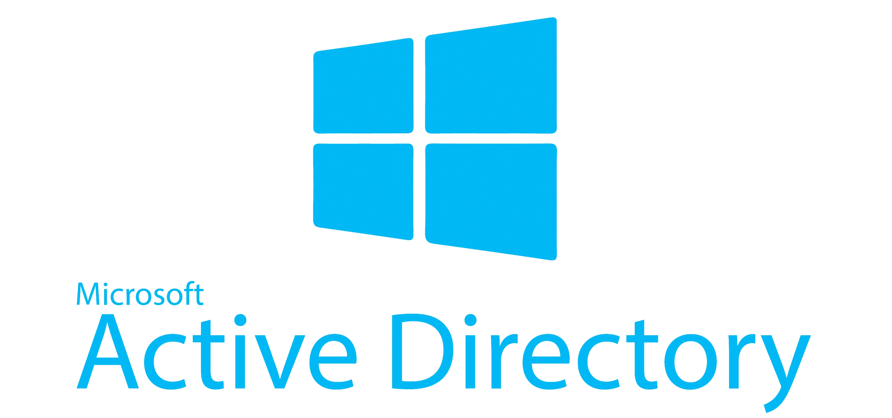
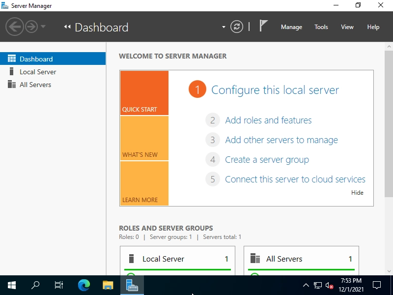
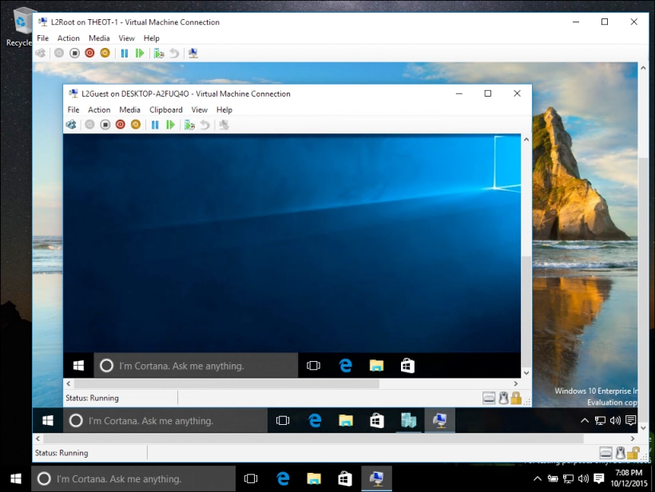
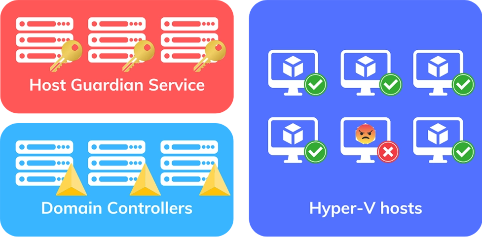
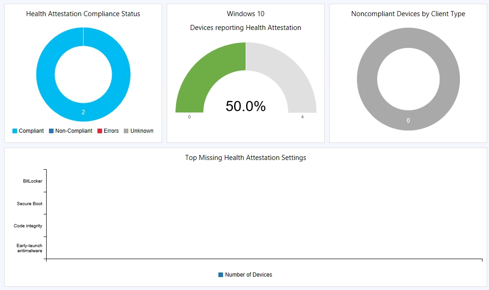

[*Read this article in english*](https://timothechau.vet/en/posts/technique/windows-server-features)

Windows Server, c'est la version de Windows plébicitée par les entreprises pour leur infrastructure *on-premises* (le contraire du Cloud, c'est-à-dire une infrastructure hébergée localement). Elle propose différentes solutions, ou *roles* que l'on ne retrouve pas (toujours) dans les versions traditionnelles de Windows. Voici un petit tour d'horizon des rôles essentiels sur Windows Server Core.

</br>

# Active Directory (AD)

</br>

<p align="center">
  
</p>

</br>

Que serait une infra sans annuaire ? Active Directory sert exactement à ça : 
- Centraliser les utilisateurs
- Grouper les utilisateurs en rôles
- Gérer les droits d'accès aux ressources
- Gérer les ordinateurs et appareils connectés au réseau

Active Directory gère le *domaine* de l'entreprise, et les utilisateurs peuvent s'y connecter grâce à un identifiant.

Il intègre différents services, qui sont souvent confondus avec Active Directory lui-même, que voici.

</br>

### Active Directory Domain Services (ADDS)

LA killer feature d'Active Directory. ADDS est, en gros, le service de gestion d'annuaire, inclus dans AD :
- Propose les services d'authentification 
- Gère les autorisations sur le réseau
- Hiérarchise les composants
- Réplique les données

On parle alors de Domain Controller (DC).

C'est d'ailleurs par ses fonctionnalités qu'on méprend souvent ADDS pour AD. Cependant, bien qu'essentiel, ADDS est une composante d'AD et non un service distinct.

</br>

### Active Directory Lightweight Directory Services (ADLDS)

ADLDS une version allégée d'ADDS. Il ne contient pas les fonctionnalités d'ADDS car il est plus simple et rapide d'accès. On ne parle pas ici de Domain Controller (DC) car c'est un annuaire autonome léger. 

Il est généralement utilisé dans des applications, car il permet d'avoir un annuaire simple et rapide. 

</br>

### Active Directory Certificate Services (ADCS)

On parle ici de PKI (Public Key Infrastructure), c'est à dire la gestion des certificats. ADCS permet de :
- Générer des certificats
- Permettre, grâce à ces certificats, le chiffrement et la signature des données
- Authentifier des demandes

C'est avec ADCS qu'on peut vraiment parler de sécurité des communications dans une infra Windows.

</br>

### Active Directory Federation Services (ADFS)

En permettant l'authentification unique (SSO pour Single Sign-On), ADFS permet à un utilisateur de se connecter à plusieurs services grâce à un seul compte. C'est un peu comme le bouton "Se connecter avec Google" qu'on voit un peu partout, mais à l'échelle d'une entreprise.
- Authentification unique sur des services internes et externes
- Agit comme un proxy entre AD et l'application

</br>

### Active Directory Rights Management Services (ADRMS)

Arrivé dans la version Windows Server 2008 R2, AD RMS répond à la problématique de la protection des informations sensibles. Même si ces données sont partagées en dehors du domaine (par exemple un rapport financier Excel ou un PowerPoint de stratégie), ce rôle permet aux administrateurs de mettre en place des restrictions d'accès à ces documents.

Il s'agit d'un service de sécurité, notamment pour les droits. Il permet de :
- Protéger les données en mettant en place des autorisations d'accès (Word, Outlook...)
- Mettre en place des modèles de documents, type Confidentiel ou Secret
- Protéger en permanence les documents qui transitent sur le réseau grâce aux outils de sécurité (pare-feu, contrôles d'accès...)

</br>
</br>

# Fonctionnalités de serveur

Ça ne vous aura pas échappé que Windows Server est plutôt utilisé... pour des serveurs. Voici quelques fonctionnalités qui peuvent être ajoutées à un serveur Windows.

</br>

<p align="center">
  
  <p style="text-align: center;"><i>Écran de Server Manager pour ajouter des rôles <a href="https://www.server-world.info/en/note?os=Windows_Server_2022&p=active_directory&f=1">(source)</a></i></p>
</p>

</br>

### Dynamic Host Configuration Protocol (DHCP)

À la base du protocole internet (IP), DHCP permet de distribuer des adresses IP privées aux appareils connectés au réseau. C'est un service essentiel pour éviter les conflits d'adresses IP. 

Pour illustrer mon propos, si vous allez sur votre ligne de commande et que vous tapez 
```bash
# Windows
ipconfig /all
# Linux/Mac
ifconfig 
```

Vous aurez les adresses IP de vos 24 téléphones connectés au Wi-Fi, ainsi que l'adresse IP du serveur DHCP.

Ce n'est donc pas un service propre à Windows Server, mais dans une infrastructure *on-premises*, celui-ci est essentiel.

</br>

### Domain Name System (DNS)

Les adresses IP c'est sympa, mais on est habitués à accéder à des serveurs en accédant à un nom de domaine. Un peu comme mon splendide domaine `timothechau.vet` qui renvoie vers une adresse IP publique d'un serveur. Il est possible d'installer ce composant sur Windows Server pour avoir l'équivalent en interne.

Vous remarquerez peut-être sur votre réseau qu'il y a une imprimante connectée grâce à un nom de domaine (par exemple `imprimante.etage01.lan`). Même si elle a une IP privée attribuée par le serveur DHCP, elle peut aussi avoir un nom de domaine, pour y accéder + facilement.

</br>

### File Services

File and Storage Services vous permet de partager des fichiers en interne. 

Dans le navigateur de fichiers, vous avez peut-être quelques dossiers dans les emplacements du réseau local. C'est le rôle que remplit File Services.

Ces dossiers ne seront plus accessibles une fois le réseau quitté.

Vous pouvez aussi mettre en place DFS (Distributed File System) pour avoir un partage de fichiers redondant, et réduire les chances d'une paralysie des fichiers en cas de panne d'un serveur.

</br>

### Print and Document Services

Permet de gérer les imprimantes. 

Contrairement à File Services, il connecte en réseau les imprimantes et non les dossiers et fichiers. Il peut aussi utiliser le rôle DNS pour attribuer un nom de domaine aux imprimantes.

</br>

### Hyper-V Server

</br>

<p align="center">
  
  <p style="text-align: center;"><i>Exemple d'une VM dans une VM avec Hyper-V <a href="https://share-danielfeau.com/es/introducci%C3%B3n-a-hyper-v-en-windows-10/">(source)</a></i></p>
</p>

</br>

L'hyperviseur par excellence de Microsoft. Hyper-V permet de créer des machines virtuelles (VM), et donc de virtualiser des serveurs. 

C'est comme si vous aviez un ordinateur dans votre ordinateur. 

La VM est la base des ressources cloud. Ce rôle Hyper-V ajouté avec Windows Server 2008 n'a [pas été grandement mis à jour depuis 2019](https://www.altaro.com/hyper-v/end-of-hyper-v-server/). En effet, Microsoft pousse à l'adoption de ses services cloud Azure, une stratégie sur le long terme.

Vous avez de nombreuses alternatives, comme (le récemment fusionné) VMware, ou encore VirtualBox pour une utilisation plus personnelle.

</br>

### Host Guardian Service (HGS)

HGS permet de sécuriser les machines virtuelles Hyper-V. Voici notamment son fonctionnement :

* L'organisation utilise des VMs de génération 2 dites *shielded* (protégées), car elles 
  1. sont chiffrées avec BitLocker
  2. émulent une puce Trusted Platform Module (TPM) virtuelle
  3. sont lancées sur des hôtes fiables

</br>

* HGS s'assure dont de la fiabilité des hôtes Hyper-V pour démarrer les VMs *shielded*
  1. Le rôle HGS est attribué à des serveurs dédiés
  2. Les hôtes Hyper-V sont enregistrés dans HGS
  3. HGS vérifie que les hôtes sont fiables (puce TPM 2.0, accès Just Enough Administration...)

</br>

<p align="center">
  
  <p style="text-align: center;"><i>Schéma de surveillance des serveurs HGS sur les hôtes Hyper-V</i></p>
</p>

</br>

### Remote Desktop Services (RDS)

Les serveurs Windows Server avec ce rôle peuvent utiliser la plateforme Remote Desktop Services (RDS) pour héberger des applications (RemoteApps) et des bureaux virtuels. L'idée est de permettre à des utilisateurs de se connecter à distance à un serveur dans le réseau local. C'est la solution VDI (Virtual Desktop Infrastructure) de Microsoft.

RDS propose ces services :
- Remote Desktop Session Host : pour héberger les sessions ; il utilise notamment le protocole RDP (Remote Desktop Protocol)
- Remote Desktop Web Access : pour accéder aux applications de l'intranet via un navigateur
- Remote Desktop Connection Broker : pour rediriger les connexions
- Remote Desktop Gateway : pour sécuriser les connexions
- Remote Desktop Licensing : pour gérer les licences

</br>

### Remote Access

Remote Access permet de se connecter à un réseau interne depuis l'extérieur. 

Il existe plusieurs moyens de faire ça :
1. VPN (Virtual Private Network) : un tunnel chiffré qui utilise un protocole que vous connaissez certainement (OpenVPN, L2TP/IPsec, SSTP, Wireguard...)
2. DirectAccess : une alternative aux traditionnels VPNs, qui agit de manière + transparente
3. Web Application Proxy : un proxy pour les applications web internes accédées depuis l'extérieur
4. Routing service : un service de routage pour connecter des réseaux entre eux (donc pas pour un utilisateur)

</br>

### Web Server Internet Information Services (IIS)

Le plus intéressant pour la fin : IIS, le serveur web de Microsoft, permet d'héberger des sites web.

[Selon Wappalyzer en 2024](https://www.wappalyzer.com/technologies/web-servers/), 4,8% des sites web tournent sur IIS, loin derrière les solutions open-source Apache et Nginx.

</br>
</br>

# Les quelques autres rôles

</br>

### Windows Server Update Services (WSUS)

WSUS permet de gérer les mises à jour de Windows Server. 

Quand on gère une grosse infrastructure, il est parfois compliqué de mettre à jour Windows à cette échelle. WSUS permet de centraliser les mises à jour, et de les installer à grande échelle.

</br>

### Device Health Attestation

Ce service permet de vérifier la santé des appareils connectés au réseau.

Il se concentre sur la sécurité (puces TPM), et les logs. La fonctionnalité *assessment* permet de faire un bilan de l'infra

</br>

<p align="center">
  
  <p style="text-align: center;"><i>Exemple de <a href="https://www.oscc.be/sccm/configmgr/tp/intune/hybrid/aad/azure/windows%2010/TP-1706-DHA">Tom Degreef</a></i></p>
</p>

</br>

### Volume Activation Services (VAMT)

VAMT permet d'activer les licences Windows en volume. 

Si vous avez déjà bidouillé votre ordinateur personnel, vous avez probablement entendu parler de KMS (Key Management Service), qui permet d'activer Windows sans passer par le site de Microsoft. 

VAMT permet notamment d'attribuer les clés d'activation (Windows, Office) à des groupes d'ordinateurs en utilisant KMS.

</br>

### Windows Server Essentials Experience

Le dernier pour la fin : Windows Server Essentials Experience est un ensemble de services pour les petites entreprises.

Un peu comme ADLDS avec AD, il est possible de se passer de Windows Server Essentials Experience. Plutôt que d'avoir l'entièreté des fonctionnalités, ce rôle permet de regrouper l'essentiel. Cette fonctionnalité est réservée aux infrastructures avec au maximum
- 25 utilisateurs
- 50 appareils

</br>
</br>

# Conclusion et remerciements

Vous avez maintenant compris que Windows Server n'est pas fait pour être installé que sur un seul ordinateur, et que les ordinateurs avec Windows Server ne se ressemblent pas.

Il est possible de gérer son infra *on-premises* de manière centralisée, et de tout gérer depuis un seul endroit. Mais tout l'intérêt d'Active Directory repose sur la fédération des appareils dans un domaine.

Si un ordinateur avec Windows Server venait à tomber en panne, une organisation peut prévoir une bonne répartition des rôles, de manière à garder son infra résiliente. Ainsi, un autre serveur prendrait le relais, et votre infra ne serait pas impactée.

Merci à [Microsoft](https://learn.microsoft.com/en-us/windows-server/administration/server-core/server-core-roles-and-services) pour leur article listant tous les rôles (et pour Copilot qui m'aura bien servi).

L'initiative de cet article est largement inspirée d'une formation de [Thibault Gibard](https://akril.net) sur Windows Server, que je voulais retranscrire de mémoire dans un article.

---

Bannière "Multi-tasking" générée par [DALL•E](https://labs.openai.com)