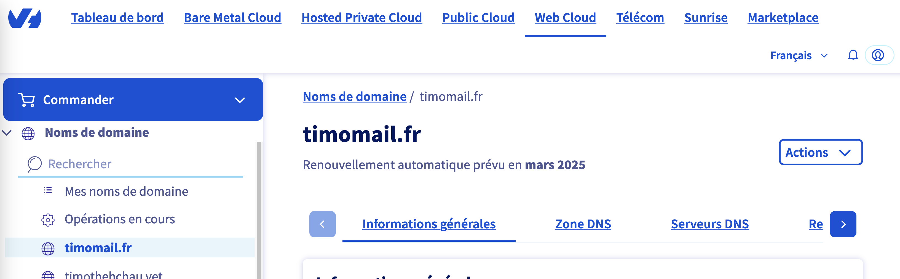

[*Lire cet article en français*](https://timothechau.vet/posts/tutoriels/catch-all/)

Until now, whenever a restaurant or website asked for my email address, I was reluctant to give out my real address. I'm obsessed with never reusing the same password, and I also don't want my email address to be sold to third parties. If this is your case, there are several solutions, including the **Catch-All email address** which allows you to use any different addresses as you wish.

Just imagine:
- You go to your favorite [Le Caleçon Français](https://www.zdnet.fr/actualites/le-slip-francais-victime-dune-fuite-de-donnees-390787.htm) store.
- You are offered a loyalty card to reward you for being a good customer.
- You are asked for your email.
- You proudly reply: *"caleçon at timomail dot fr"*.
- The person at the cash register, puzzled, asks you to repeat.

Yes, she heard you correctly. You could also have answered `lecaleçonfrançais@timomail.fr`, `lcf@timomail.fr` or even `how-long-are-they-going-to-make-me-repeat-myself@timomail.fr` and it would have worked.

Even without explicitly creating the address `caleçon@timomail.fr`, you can be sure that the newsletters will arrive at their destination. It's because you activated the Catch-All on timomail.fr that it's possible.

I mentioned some reservations in the conclusion that are to be taken into consideration.

 

  
  
<i>"Envelopes" banner generated by Dall•E on ChatGPT</i>

 

# Why use a different email each time?
 

According to [the Have I Been Pwned website](https://haveibeenpwned.com/) which lists data breaches, **there are at least 13 billion compromised accounts**. These do not necessarily include passwords, but if you reuse the same one on each site, it is very easy to hack you with a single breach.

If I have always used a different password for each account, I only very recently started using a different email for each account as well. **Who among us has never created a _trash email_** to

- avoid spam
- protect yourself from leaks
- or register on a shady site? (yes, we've all done it)

 

The idea behind using a different email is that it becomes more difficult to trace all your accounts. Several methods exist:
- `Create a trash email`: an email that you only use for shady sites, but that you will reuse often
- `Use + aliases`: an option available on some email providers like Gmail or Proton, which consists of adding a + after the identifier. For example, timothe+badoo@gmail.com will forward emails received to timothe@gmail.com. The downside is that some sites don't accept it, and a person knowing the trick can simply remove the + to find your original address
- `Subscribe to an email generator` that will allow you to create emails on the fly, such as [Firefox Relay](https://relay.firefox.com/) or [Proton Pass](https://proton.me/fr/pass/aliases). It is also possible to disable them to stop emails, or block spam at the root. This option requires you to generate the email before using it
- `Use a temporary email` that will self-destruct after a certain time, such as [Temp Mail](https://temp-mail.org/). The downside is that once the email is destroyed, you will no longer be able to see your emails
- `Use a Catch-All email`: an address that receives all emails sent to any identifier on your domain. The downside is that it needs to be configured and you need to own a domain name

 

|                    | Anonymity | Spam management | Breach-proof | Setup | Use | Price                   |
|:--------------------:|:--------:|:-----------------:|:-----------:|:-------------:|:-----------:|:----------------------:|
| Personal email         | 🌧️        | ⛅ (filters)       | 🌧️           | ☀️             | ☀️           | 0€                     |
| 2nd trash email  | ⛅️        | ☀️                 | 🌧️           | ⛅️             | ☀️           | 0€                     |
| Alias +            | ⛅️        | ⛅ (filters)       | ⛅️           | ☀️             | ⛅️           | 0€                     |
| Email generator | ☀️        | ☀️                 | ☀️           | 🌧️             | 🌧️           | 12€/year (Firefox Relay) |
| Temporary email    | ☀️        | ☀️                 | ☀️           | ⛅️             | 🌧️           | 0€                     |
| Catch-all email     | ☀️        | ☀️                 | ☀️           | 🌧️             | ☀️           | 7€/year (.fr domain)    |

 

I don't know about you, but I count more ☀️ in the Catch-All option. As for the 🌧️ in *Setup*, we'll fix that in this article!

 
 

## 1. Buy a domain name

To begin, let's buy a domain name. My favorite registrar, OVH, offers them at low prices, but any registrar can do the same.

 

  
  
<i>Management interface of your domain on OVH</i>

 

1. Go to [OVH](https://www.ovh.com/fr/domaines/) or another registrar of your choice
2. Search for an available domain, for example timomail.fr
3. Add it to your cart
4. Don't take any hosting, you don't need it. Uncheck options such as "DNS accelerator" which are paid
5. Optionally, reserve your domain name for several years, the price of which will naturally increase each year
6. Pay by creating an account
7. Wait for your domain name to be available on your portal (about 15min)

 

Once you have your domain name, you now need to get rid of the DNS servers for those of CloudFlare.

 
 

## 2. Register your site on Cloudflare

The second step is to register on CloudFlare, which allows the Catch-All functionality and is free.

1. [Register on CloudFlare](https://dash.cloudflare.com/sign-up?pt=f) if it's not already done
2. Once on your interface, click on "Add a site"
3. Enter your domain name and choose the Free option
4. CloudFlare needs to scan the site, and then offers to change the DNS servers
5. Copy the 2 DNS servers and replace those in the "DNS Servers" tab of your registrar
6. Wait for CloudFlare to validate the DNS server change (about 15min)

 

  
  
<i>CloudFlare asks to install 2 DNS servers</i>

 

## 3. Configure the Catch-All email

Now that your domain is on CloudFlare servers, you can manage DNS entries as you like. For the purposes of this tutorial, we won't need them.

1. In the "Email" tab, go to "Email routing"
2. Do "Getting started" then "Skip" to skip the configuration
3. You should have a text "Email Routing is currently disabled and not routing emails. Enable Email Routing"; click on "Enable Email Routing" if so
4. Delete all the records that CloudFlare shows, and add the ones proposed by CloudFlare
5. Once the change is made (1-2min), go to the "Routing rules" option
6. In "Catch-all address", configure the action to "Send to an email" then put the email that will receive all emails sent to the domain
7. Save, and remember to activate the option in "Status"

 
 

  <img src="cloudflare_routing.webp" alt="