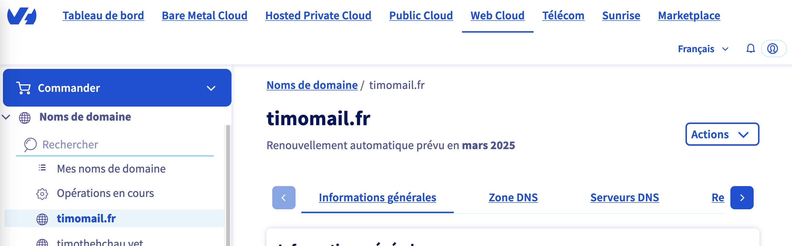
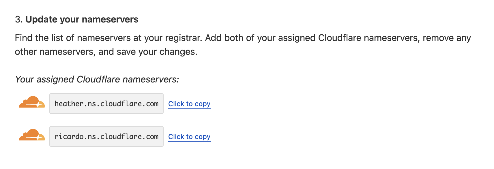
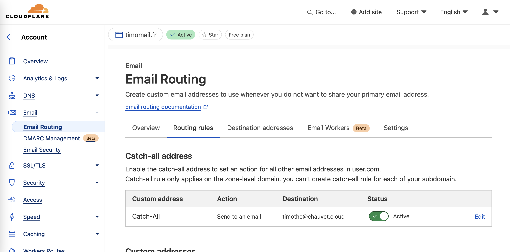

[*Read this article in english*](https://timothechau.vet/en/posts/tutoriels/catch-all/)

Jusqu'ici, quand un restaurant ou un site demandait mon adresse e-mail, je rechignais à donner ma vraie adresse. Je suis obsédé à l'idée de ne jamais réutiliser le même mot de passe, et je ne veux pas non plus que mon adresse e-mail soit revendue à des tiers. Si tel est votre cas, il existe plusieurs solution, dont **l'adresse mail Catch-All** qui permet d'avoir une adresse différente au gré de vos envies. 

Imaginez juste : 
- Vous allez dans votre boutique [Le Caleçon Français](https://www.zdnet.fr/actualites/le-slip-francais-victime-dune-fuite-de-donnees-390787.htm) préférée.
- On vous propose une carte de fidelité pour récompenser le bon client que vous êtes. 
- On vous demande votre email.
- Vous répondez tout fièrement : *"caleçon arobase timomail point fr"*. 
- La personne à la caisse, interloquée, vous demande de répéter. 

Eh oui, elle a pourtant bien entendu. Vous auriez aussi pu répondre `lecaleçonfrançais@timomail.fr`, `lcf@timomail.fr` ou même `ils-vont-me-prendre-la-tête-encore-combien-de-temps@timomail.fr` que ça aurait fonctionné.

Même en n'ayant pas créé explicitement l'adresse `caleçon@timomail.fr`, vous pouvez être sûr que les newsletters arriveront bien à destination. C'est parce-que vous avez activé le Catch-All sur timomail.fr que c'est possible

J'ai mentionné des réserves en conclusion qui sont à prendre en considération.

 

  
  
<i>Bannière "Enveloppes" générée par Dall•E sur ChatGPT</i>

 

# Mais pourquoi utiliser un mail différent à chaque fois ?
 

Selon [le site Have I Been Pwned](https://haveibeenpwned.com/) qui recense les fuites de données, **on compte au moins 13 milliards d'identifiants compromis**. Ceux-ci n'intègrent pas forcément les mots de passe, mais si vous réutilisez le même sur chaque site, il est simplissime de vous pirater avec une seule brèche.

Si j'ai toujours utilisé un mot de passe différent à chaque compte, je n'ai que très récemment commencé à utiliser un mail différent à chaque compte aussi. **Qui d'entre-nous n'a pas déjà fait un _mail poubelle_** pour 

- éviter les spams
- se protéger des fuites 
- ou généralement s'inscrire sur un site louche ? (oui, on l'a tous fait)

 

L'idée derrière l'utilisation d'un mail différent est qu'il devient plus compliqué de retracer tous vos comptes. Plusieurs méthodes existent :
- `Créer un mail poubelle` : un mail que vous n'utilisez que pour les sites louche, mais que vous réutiliserez souvent
- `Utiliser les alias +` : option disponible sur certains fournisseurs de mail comme Gmail ou Proton, qui consiste à ajouter un + après l'identifiant. Par exemple, timothe+badoo@gmail.com renverra les mails reçus sur timothe@gmail.com. L'inconvénient est que certains sites ne l'acceptent pas, et une personne connaissant l'astuce peut simplement enlever le + pour retrouver votre adresse
- `Souscrire à un générateur de mails` qui vous permettra de créer des mails à la volée, comme [Firefox Relay](https://relay.firefox.com/) ou [Proton Pass](https://proton.me/fr/pass/aliases). Il est aussi possible de les désactiver pour stopper les mails, ou bloquer les spams à la racine. Cette option demande de générer le mail avant de l'utiliser
- `Utiliser un mail temporaire` qui s'autodétruira après un certain moment, comme [Temp Mail](https://temp-mail.org/). L'inconvénient est qu'une fois le mail détruit, vous ne pourrez plus voir vos mails
- `Utiliser un mail Catch-All` : une adresse qui reçoit tous les mails envoyés à n'importe quel identifiant de votre domaine. L'inconvénient est qu'il faille le configurer et que vous devez posséder un nom de domaine

 

|                    | Anonymat | Gestion des spams | Para-fuites | Mise en place | Utilisation | Prix                   |
|--------------------:|:--------:|:-----------------:|:-----------:|:-------------:|:-----------:|:----------------------:|
| Mail perso         | 🌧️        | ⛅ (filtres)       | 🌧️           | ☀️             | ☀️           | 0€                     |
| 2nd mail poubelle  | ⛅️        | ☀️                 | 🌧️           | ⛅️             | ☀️           | 0€                     |
| Alias +            | ⛅️        | ⛅ (filtres)       | ⛅️           | ☀️             | ⛅️           | 0€                     |
| &nbsp;&nbsp;Générateur de mail | ☀️        | ☀️                 | ☀️           | 🌧️             | 🌧️           | 12€/an (Firefox Relay) |
| Mail temporaire    | ☀️        | ☀️                 | ☀️           | ⛅️             | 🌧️           | 0€                     |
| Mail catch-all     | ☀️        | ☀️                 | ☀️           | 🌧️             | ☀️           | 7€/an (domaine .fr)    |

 

Je ne sais pas pour vous, mais moi je compte + de ☀️ dans l'option Catch-All. Pour ce qui est du 🌧️ dans la *mise en place*, on va remédier à ça dans cet article !

 
 

## 1. Acheter un nom de domaine

Pour commencer, achetons un nom de domaine. Mon *registrar* préféré, OVH, en propose à bas prix, mais n'importe-quel *registrar* permet de faire la même chose.

 

  
  
<i>Interface de gestion de votre domaine sur OVH</i>

 

1. Allez sur [OVH](https://www.ovh.com/fr/domaines/) ou un autre *registrar* de votre choix
2. Chercher un domaine disponible, par exemple timomail.fr
3. Ajoutez-le à votre panier
4. Ne prenez pas d'hébergement, vous n'en avez pas besoin. Décochez les options telles que "DNS accelerator" qui sont payantes
5. Optionnellement, réservez votre nom de domaine sur plusieurs années, dont le prix va naturellement augmenter chaque année
6. Payez en vous créant un compte
7. Attendez que votre nom de domaine soit disponible sur votre portail (15min environ)

 

Une fois que vous avez votre nom de domaine, il faut maintenant vous débarrasser des serveurs DNS pour ceux de CloudFlare.

 
 

## 2. Inscrire son site sur Cloudflare

La deuxième étape consiste à s'inscrire sur CloudFlare, qui permet la fonctionnalité Catch-All et est gratuit.

1. [S'inscrire sur CloudFlare](https://dash.cloudflare.com/sign-up?pt=f) si ce n'est pas déjà fait
2. Une fois sur votre interface, cliquer sur "Add a site" 
3. Rentrer son nom de domaine et choisir l'option Free
4. CloudFlare doit scanner le site, et propose ensuite de changer les serveurs DNS
5. Copier les 2 serveurs DNS et remplacer ceux dans l'onglet "Serveurs DNS" de votre *registrar*
6. Attendre que CloudFlare valide le changement de serveurs DNS (15min environ)

 

  
  
<i>CloudFlare demande d'installer 2 serveurs DNS</i>

 

## 3. Configurer le mail Catch-All

Maintenant que votre domaine est sur les serveurs CloudFlare, vous pouvez gérer les entrées DNS comme vous voulez. Dans le cadre de ce tutoriel, on n'en aura pas besoin.

1. Dans l'onglet "Email", aller dans "Email routing"
2. Faire "Getting started" puis "Skip" pour ignorer la configuration
3. Vous devriez avoir un texte "Email Routing is currently disabled and not routing emails. Enable Email Routing" ; cliquer sur "Enable Email Routing" si c'est le cas
4. Supprimer tous les enregistrements que CloudFlare montre, et ajouter ceux proposés par CloudFlare
5. Une fois le changement fait (1-2min), allez sur l'option "Routing rules" 
6. Dans "Catch-all address", configurez l'action sur "Send to an email" puis mettre l'email qui recevra tous les mails envoyés au domaine
7. Sauvegardez, et pensez à activer l'option dans "Status"

 
 

  
  
<i>Vérifiez que l'option Active est cochée</i>

 
 

# Conclusion

Ce n'était pas si compliqué, non ? En prenant une petite heure de son week-end et 7€ par an, vous avez maintenant la possibilité de recevoir vos mails sur autant d'adresses que vous souhaitez, tout en ne gardant qu'un mail principal.

Gardez bien en tête ces quelques points :
- Il est possible que votre *registrar* diffuse des informations sur vous publiquement. Renseignez-vous sur `hide whois <votre-registrar>` si vous n'avez pas pris OVH (qui cache ces informations par défaut)
- Garder bien le paiement actif sur votre *registrar*, sinon vous risquez de perdre votre domaine ! Dans tous les cas, vous serez prévenus par mail avant la date d'expiration
- Certains sites **obligent** à entrer un mail sur Gmail ou Outlook. Référez-vous à l'option "Email poubelle" 👀
- Vous ne pouvez pas envoyer de mail avec cette adresse, seulement en recevoir. 
  - En fait si vous pouvez, mais ça demande une configuration avec un autre service mail, ce qui implique de retirer le Catch-All si jamais ce service de mail n'a pas l'option
  - Google Workspace et ProtonMail Plus permettent d'envoyer/recevoir des mails avec votre domaine en plus du Catch-All, mais sont payants. Il y en a d'autres que je ne connais pas
  - Sinon, vous pouvez aussi répondre avec l'email mentionné dans l'étape 3.6

---

Si vous avez des questions ou des suggestions, n'hésitez pas à me contacter par [mail](mailto:timothe@chauvet.cloud), sur [LinkedIn](https://www.linkedin.com/in/timothechauvet/) ou directement en envoyant [une *issue* sur GitHub](https://github.com/timothechauvet/timothechauvet.github.io/issues)