Lorsque je fais des formations Microsoft, je donne comme objectif à mes élèves qu'ils passent la formation associée dans les 2 semaines qui suivent. Mais pour l'inscription à un examen, c'est une autre paire de manches. Voici, en images, les étapes pour le faire en ligne. J'ai ici pris l'exemple d'une inscription à la certification AZ-900, mais le processus est fondamentalement le même pour les autres certifications Microsoft.

 
 

## Étape 1 • Créer son profil de certification avec un compte Microsoft personnel

Bonne nouvelle : cette étape n'est à faire une fois. Pour les prochaines, vous n'aurez qu'à changer les infos à la volée.

Recherchez sur internet votre certification. Dans notre exemple, nous irons sur la page "Exam AZ-900: Microsoft Azure Fundamentals" sur `learn.microsoft.com`. En bas de la page, choisissez "Schedule with Pearson VUE"

 

  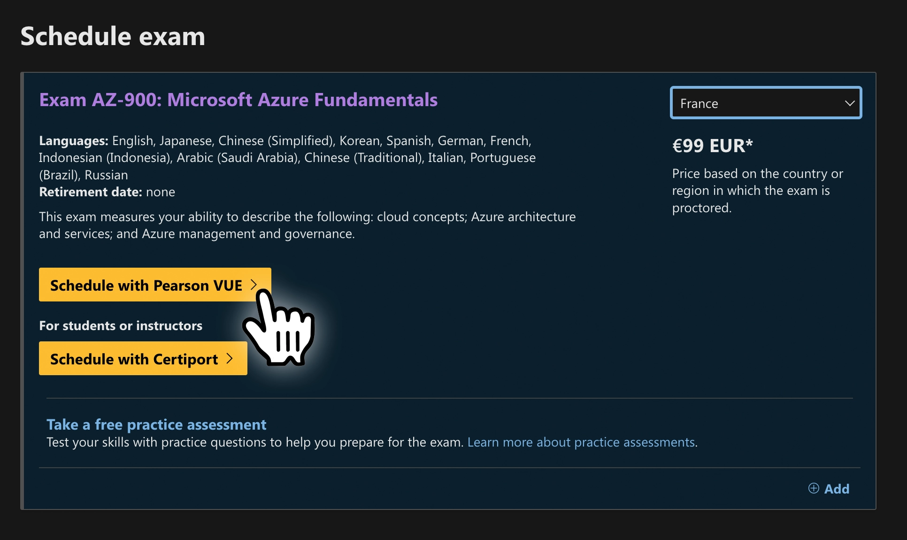
  
<i>Screen 1 : Commencer la démarche avec Pearson VUE</i>

Vous devrez ensuite vous connecter à un compte Microsoft : **prenez votre compte personnel**. Si vous n'en avez pas, créez-en un. C'est nécessaire car ces certifications doivent vous suivre toute votre vie ; sur un compte Microsoft entreprise il y a des chances que vous perdiez vos certifications.

Vous serez redirigé vers `examregistration.microsoft.com` pour créer votre profil de certification. Rentez simplement vos informations personnelles. 

Mettez "33" dans le champ `Code de la zone` / `Country code` pour la France et le reste de votre numéro dans `Numéro de téléphone` / `Phone number`. Attention aussi à toujours mettre votre mail Microsoft personnel. 

Cochez la case des conditions d'utilisation et continuez.

 

  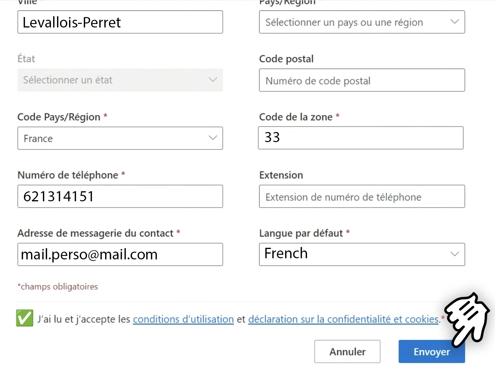
  
<i>Screen 2 : Remplir les champs avec votre mail perso</i>

Et voilà, votre profil de certification est créé et à jour !

  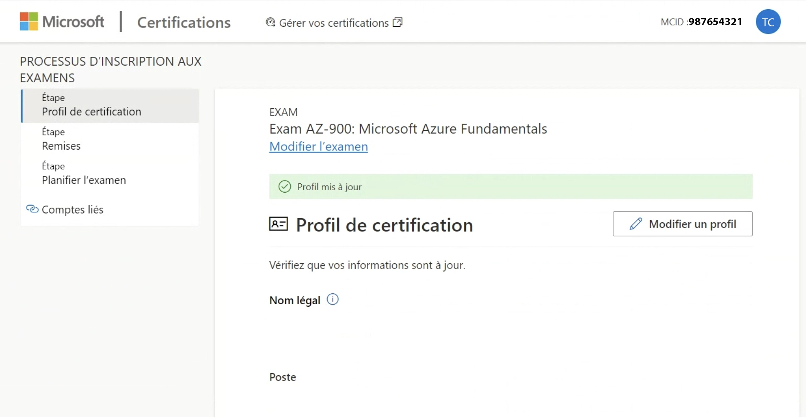
  
<i>Screen 3 : Le profil a été mis à jour, cliquer sur Suivant</i>

# Étape 2 • Ajouter un code de réduction avec une entreprise partenaire

Si vous faites partie d'une entreprise partenaire (programme Enterprise Skills Initiative ou ESI), vous devriez avoir une réduction de 50% sur les examens. Chez Devoteam c'est le cas, certainement chez beaucoup d'ESN aussi. 

Dans le cas contraire, passez directement à l'étape 3.

Pour cela il faudra **associer votre mail pro à votre profil de certification**. 

 

  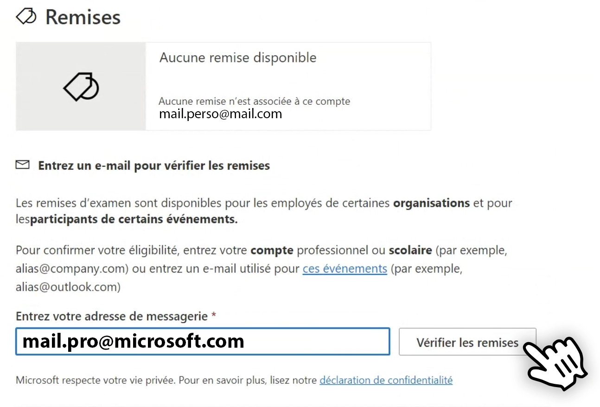
  
<i>Screen 4 : Remplir votre mail entreprise et vérifiez les remises</i>

Après avoir cliqué sur "Vérifier les remises", vous allez recevoir un mail sur votre boîte pro avec un code à 6 chiffres. 

Notez bien que **ce mail prend beaucoup de temps à arriver**. Il peut prendre entre 5min et 24h, donc **gardez bien l'onglet ouvert** si vous voulez associer votre compte pro.

 

  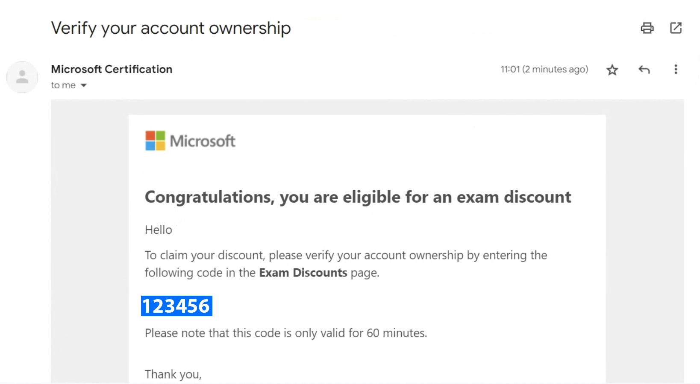
  
<i>Screen 5 : Copier le code à 6 chiffres</i>

 

  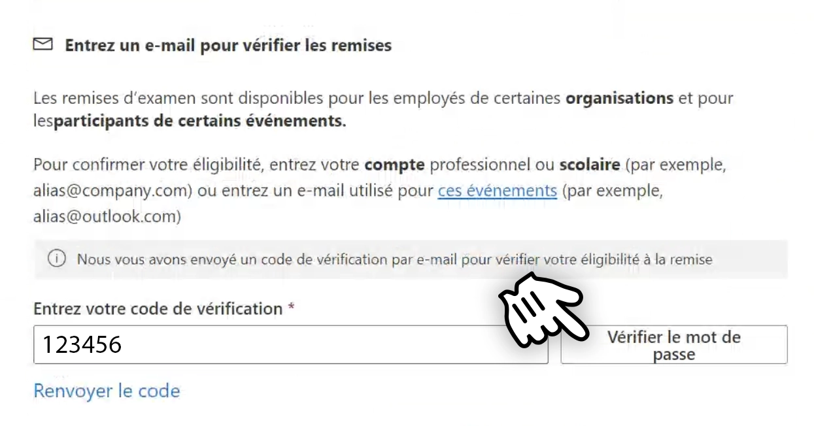
  
<i>Screen 6 : Rentrer le code et vérifier le mot de passe</i>

 

  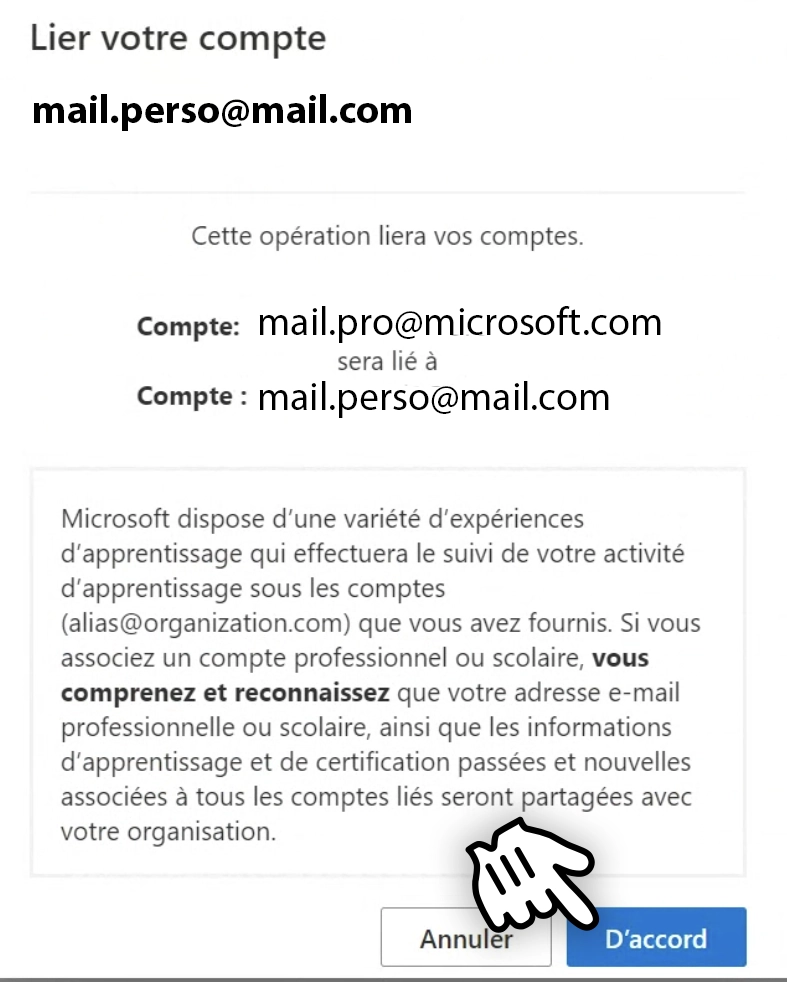
  
<i>Screen 7 : Accepter d'associer ce mail au profil de certification ; vous pouvez en ajouter autant que vous voulez</i>

 

  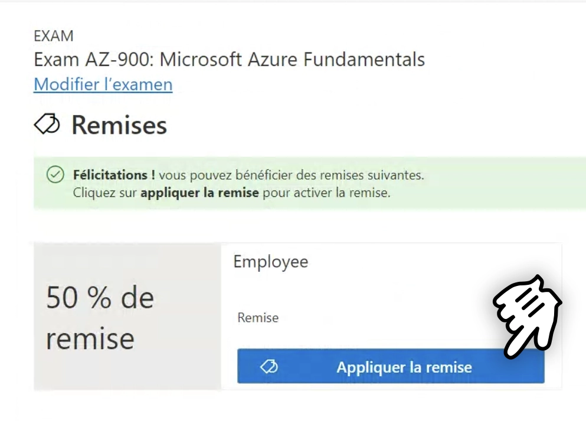
  
<i>Screen 8 : Appliquer la remise de 50%</i>

# Étape 3 • Sélectionner l'examen en ligne

Maintenant que votre profil de certification est créé, vous n'aurez pas à tout re-remplir ni à ré-associer votre mail pro. 

Vous pouvez maintenant planifier votre examen sur le site de Pearson. Nous allons voir pour le planifier en ligne, c'est-à-dire avec OnVUE.

 

  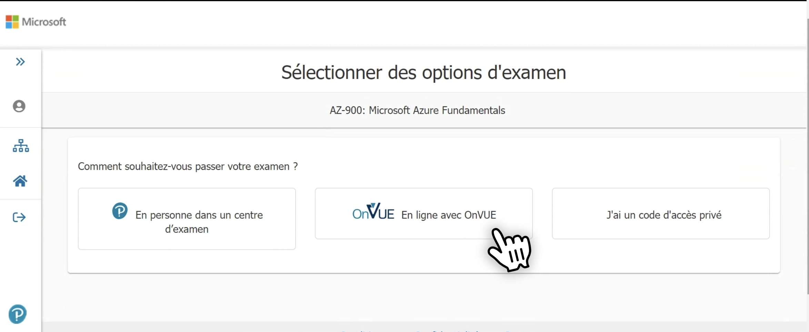
  
<i>Screen 9 : Choisir l'examen en ligne avec VUE</i>

## Mais d'abord, pourquoi choisir un examen en ligne ?

J'ai des collègues qui ont dû passer l'examen dans un centre, ce qui n'est envisageable que si on vit proche des métropoles. Tout comme l'examen du code de la route, vous devez vous déplacer en centre d'examen Pearson et le passer sur un des ordinateurs fournis sur place.

Il faut ainsi dédier une demi-journée à l'examen, c'est pourquoi je vous recommande de le passer en ligne. 

Mais si
- vous n'avez pas de webcam
- vous n'avez pas de micro
- vous n'avez pas de pièce isolée
- votre internet est instable
- vous avez des enfants ou des animaux ou des travaux...

alors il peut être préférable de le passer en centre d'examen. Je vous recommande quand-même de repousser la date de passage pour le faire en ligne, le temps de récupérer du matériel approprié ou de trouver un endroit calme pour l'examen à distance, car c'est bien + pratique.

## Les modalités du passage en ligne

Pour passer l'examen en ligne, [**vous devez vous munir d'un Mac ou d'un Windows modernes**](https://home.pearsonvue.com/op/OnVUE-technical-requirements). Un logiciel, Pearson OnVUE, de >100Mo, doit être téléchargé à chaque examen (il est à retélécharger à chaque fois donc vous pourrez le supprimer après l'examen).

 

  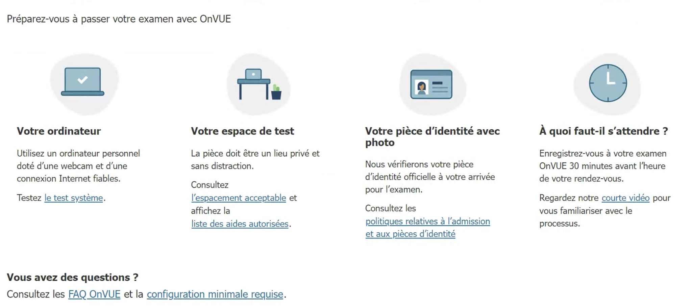
  
<i>Screen 10 : Les modalités d'examen de Pearson VUE</i>

Ce logiciel doit être **le seul à être utilisé sur votre ordinateur**. On vous dira s'il reste des logiciels ouverts lors de l'examen. Généralement il vous faudra votre ordinateur perso, car les ordinateurs d'entreprise sont souvent bridés (mais pas toujours). Tant que vous avez les droits d'administrateur, vous pouvez le faire sur un ordinateur d'entreprise.

Comme dit précédemment, **vous allez être filmé, écouté et votre écran sera aussi filmé**. Vous devez être 
- seul dans la pièce 🙁
- sans bruit 🔇
- sans animaux 🐔
- sans enfants (bruyants) 👶
- sans téléphone à proximité 📱
- sans montre ⌚
- sans nourriture 🍔
- sans boisson (ou bien sans étiquette) 🥤
- sans papier 📄
- sans stylo 🖊️
- dans une pièce isolée où il n'y a pas de vitre ou d'écran devant vous 🚪

Vous aurez besoin d'**une pièce d'identité à présenter à la caméra**. Vous allez en effet discuter avec un surveillant, le *proctor*, qui va vérifier que vous êtes seul et que vous n'avez pas de matériel interdit. À moins que vous choisissiez qu'il parle en japonais, il communiquera uniquement en anglais. 

Il vous demandera notamment de **montrer votre bureau sous tous ses angles**. Vous pouvez le faire avec un téléphone mais il est + simple de tout faire sur ordinateur si vous avec une webcam qui peut se déplacer ou un ordinateur portable.

# Étape 4 • Planifier l'examen

Une fois que vous avez bien lu toutes les conditions d'examen, il reste encore la planification.

Déjà, choisissez de le passer en anglais. C'est plus simple, car les questions sont souvent mal traduites et les réponses sont souvent en anglais.

 

  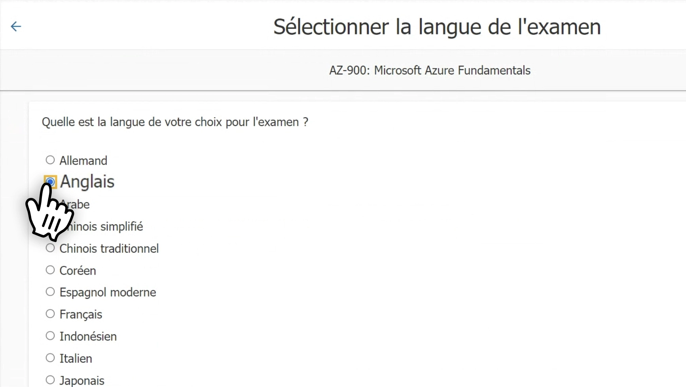
  
<i>Screen 11 : Je vous invite vraiment à passer l'examen en anglais</i>

Prenez ensuite la date qui vous convient. Vous avez la possibilité de **replanifier la date de l'examen jusqu'à 24h avant**.

 

  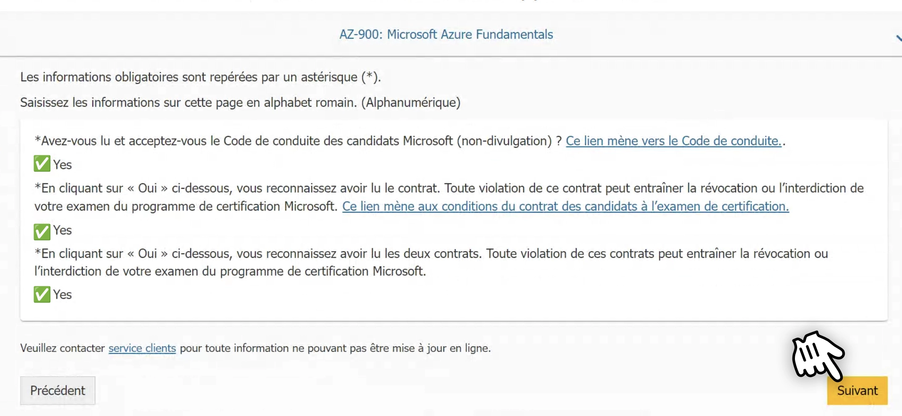
  
<i>Screen 12 : Les modalités d'examen de Pearson VUE</i>

Pearson va ensuite vous proposer une heure de rendez-vous. Des fois l'horaire proposée est en pleine nuit ; **sélectionnez "Découvrir plus d'heures" pour prendre un créneau qui vous arrange**, puis cliquez sur "Choisir ce rendez-vous" pour valider.

 

  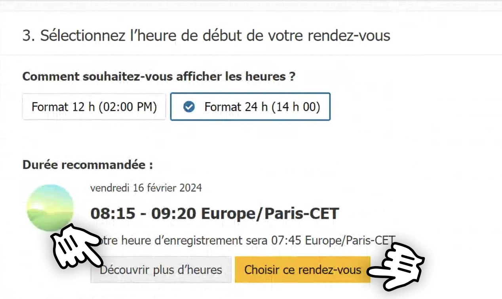
  
<i>Screen 13 : Cliquer sur Découvrir plus d'heures pour sélectionner un rendez-vous</i>

# Étape 5 • Payer l'examen ou appliquer une réduction

Si vous avez un code de réduction ou "voucher", vous pouvez l'appliquer ici. Sinon, vous pouvez payer l'examen avec une carte bancaire.

 

  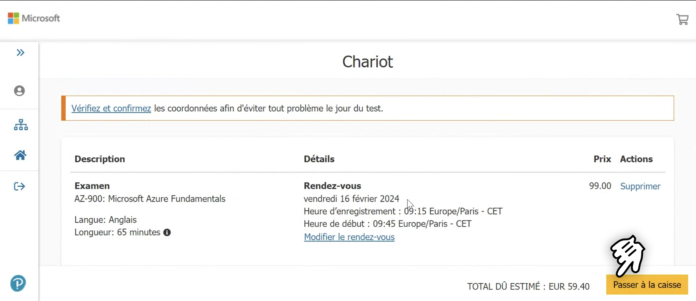
  
<i>Screen 14 : Cliquer sur Passer à la caisse</i>

Effectivement, il est possible de financer le reste de l'examen si vous avez ou non les 50% de réduction des partenaires Microsoft. **Pour cela, entrez le voucher dans le champ "Ajouter un bon d'achat ou un code de promotion"**.

 

  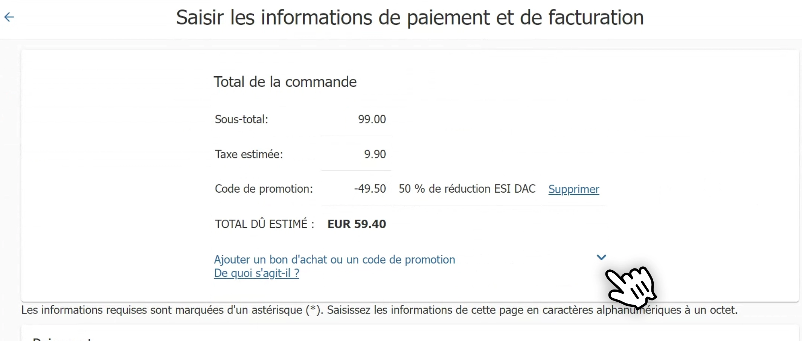
  
<i>Screen 15 : Ajouter le voucher dans le champ</i>

# Étape 6 • Récapitulatif et confirmation

Une fois le paiement effectué, vous recevrez un mail de confirmation. Vous allez aussi recevoir des mails de rappel pour votre examen, dont celui pour télécharger le logiciel Pearson OnVUE.

Dans les mails avec l'objet "Votre examen OneVUE est confirmé !", vous aurez un lien indiqué **nregistrez-vous pour commencer l’examen** (oui, sans le "E"). Cliquez dessus pour lancer l'examen le jour J

 

  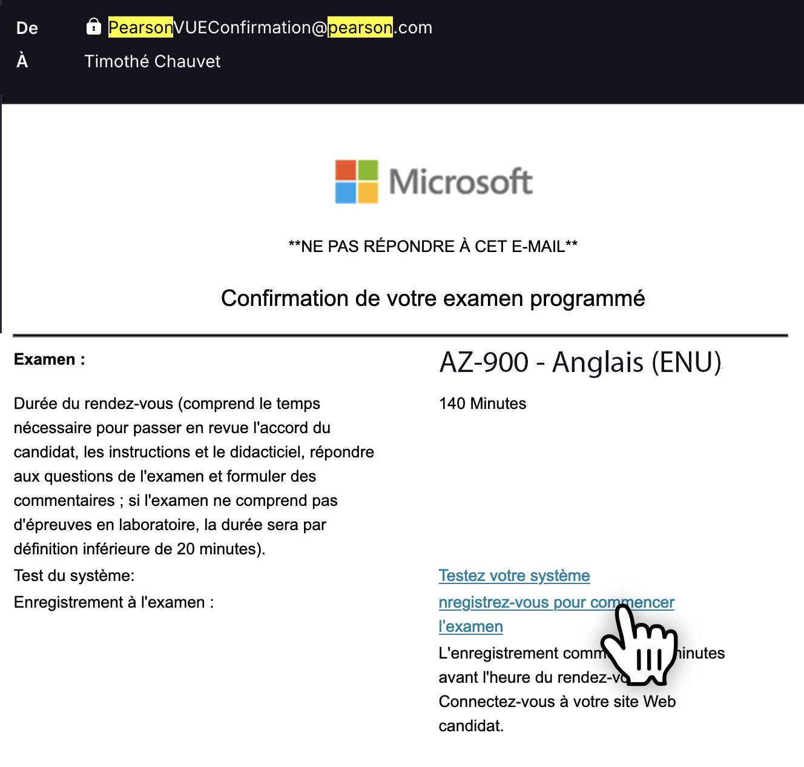
  
<i>Screen 16 : Cliquer sur le lien du mail pour commencer l'examen le jour J</i>

# Le déroulé de l'examen

Vous pourrez vous connecter 30min avant votre examen pour tout préparer, et 15min de retard sont acceptées. Dans tous les cas, vous aurez le même temps d'examen.

Cette durée est précisée selon l'examen. Par exemple, vous avez 45min pour faire la AZ-900 pour répondre de 40 à 60 questions. Vous avez cependant 3h pour répondre aux 40-60 questions de la AZ-104. **Un score de 70% est nécessaire pour réussir.**

Les questions sont des QCM (à cocher) mais certains examens plus avancés demandent une étude de cas au début. **Vous pouvez revenir sur les questions avant de les soumettre**, excepté pour l'étude de cas que vous devez terminer avant le reste. Il est plus simple de rajouter un drapeau sur une question compliquée et d'y revenir à la fin.

Une fois l'examen terminé, vous recevez votre score et vos performances par thème. Votre certification sera ajoutée à [votre profil Microsoft Learn](https://learn.microsoft.com/api/credentials/share/fr-fr/TimotheChauvet/852BFE7E79D17840?sharingId=93A17B933872B49B) et vous pourrez la partager sur internet !

 

Voilà tout ! Vous êtes maintenant inscrit pour votre examen Microsoft en ligne. Vous n'avez plus qu'à réviser et à passer l'examen. Bonne chance !

---

Bannière "Badge" générée par [DALL•E](https://labs.openai.com)

Si vous avez des questions ou des suggestions, n'hésitez pas à me contacter par [mail](mailto:timothe@chauvet.dev), sur [LinkedIn](https://www.linkedin.com/in/timothechauvet/) ou directement en envoyant [une *issue* sur GitHub](https://github.com/timothechauvet/timothechauvet.github.io/issues)