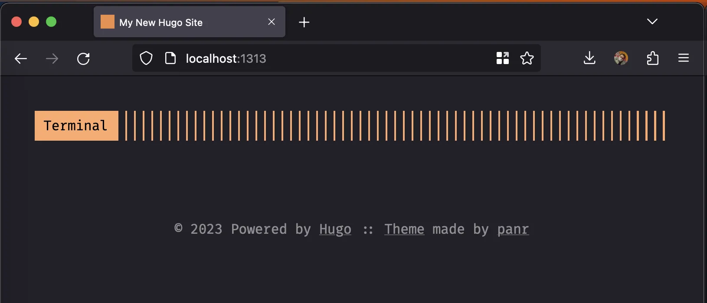
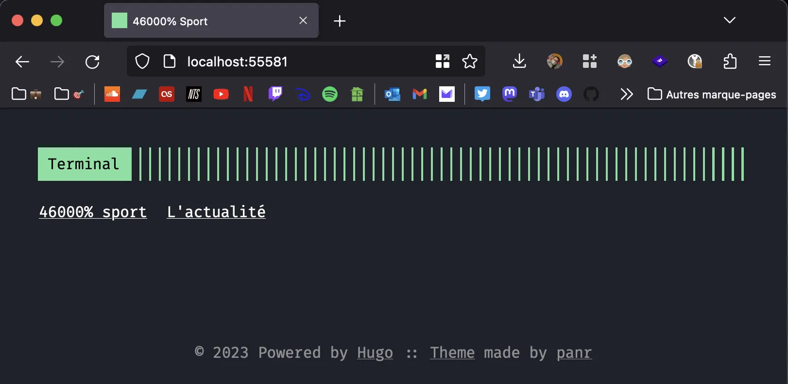
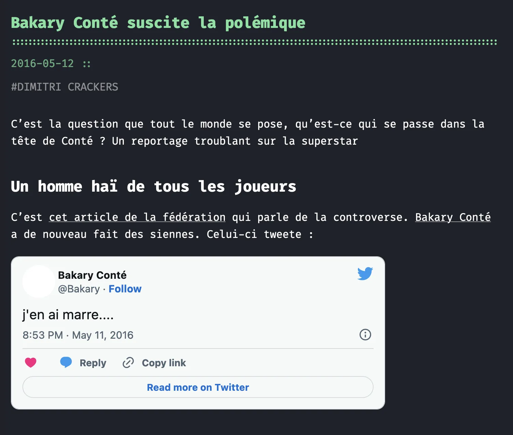
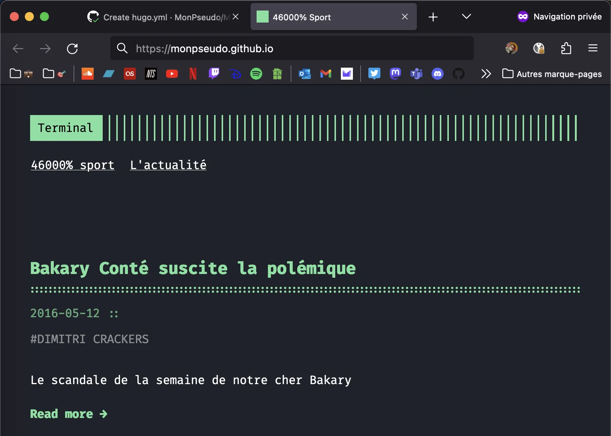

[*Lire cet article en français*](https://timothechau.vet/posts/tutoriels/site-statique-hugo/)

LinkedIn, Meta and Twitter want them down! To create content in the 20's era (from 2020 on), there is a plethora of platforms. Some are newborns (Mastodon, Notion), some are ephemeral (Google +, Skyblog), some are somewhat disliked (Facebook, Twitter), these have a life sometimes shorter than your washing machine. <u>But there is one platform that does not suffer from programmed obsolescence: blogs.</u>

In the first post of my super blog, I wanted to tell you how I made... my blog. Hosted on GitHub <i class="fa-brands fa-github"></i>, made with Hugo and maintained by me, it (almost) costs me 0€ to keep. I hope that by reading this tutorial, you will be able to realize how easy it is to make your own https://timothechau.vet for nothing.

</br>
</br>

## The problem with WordPress for blogging 😓

I'm sure I'm not the only one who thinks that building a personal website with WordPress is a waste of time. Even though 43.1% of all websites on the internet use WordPress ([W3techs, January 2023](https://w3techs.com/technologies/details/cm-wordpress)), running a dynamic, high-performance site requires a lot of investment. Some of these complications include:
- OVH hosting at 50€ per year minimum (for a decent service) 💸
- crashes 
- the panic of having 200 failed logging attempts daily
- permanently having to update the extensions
- the configuration of a CDN to have a fast website everywhere in the world
- SEO management to climb up in the Google results
- ...

In fact, WordPress is a very good [CMS](https://en.wikipedia.org/wiki/Content_management_system) to have a beautiful dynamic site. Powerful, complete, open-source, born from generation Z (in 2003!), WordPress doesn't have to prove its value anymore. However, to make a personal blog with WordPress is way too much. A static website, without all the dynamic features of WordPress, is usually enough to make a blog. And that's perfect, because you already have a static website right in front of you (amazing).

**A static website** only uses HTML, CSS and JavaScript source code and does not need a database or an extensive logical server.

</br>
</br>

## The best of the blogs with Hugo

In 2013, when Hugo Chávez left us, Hugo (the software, not the president of Venezuela) was born. This static site generator written in Go, Google's ultra-fast language, is still known as ["the world’s fastest framework for building websites"](https://gohugo.io/). 

Without going into details, it allows you to simply configure and launch your site. Open-source, free and easy to use, it has acquired a large community that has created a wide range of customizable themes. Hugo is **easy to configure**, and once done **you can forget it** and post content easily.

<p align="center">
  
  <p style="text-align: center;"><i>Go and Hugo together make <a href="https://gohugo.io">Super-Hugo</a></i></p>
</p>

</br>

#### What do you mean, a static site generator written in Go?

Hugo is indeed written in Go, because it is a software that takes code and **generates the files of a static site : HTML, CSS and JavaScript**. Therefore it doesn't need to be executed constantly, unlike a PHP site which needs a PHP server to be active at all time. Just a quick `hugo build` to write the files, and the site is ready to be hosted on a server! 

#### What about the code that Hugo takes to make a site, is it Go?

No. The Hugo software is coded in Go, but that's not the language it uses to power the site. [Markdown](https://www.markdownguide.org/), a simple language to write beautiful content, allows to write articles like this one, and the YAML, TOML or JSON formats (at your choice) allow to configure it. We will come back later on their use

#### Are there other static site generators than Hugo?

If Hugo isn't your cup of tea, [Gatsby](https://www.gatsbyjs.com/docs/how-to/previews-deploys-hosting/how-gatsby-works-with-github-pages/) and [Jekyll](https://docs.github.com/en/pages/setting-up-a-github-pages-site-with-jekyll) do the same thing

</br>
</br>

## The main steps of this tutorial

Hugo being made of code (like any other website), it is possible to host this code in a GitHub <i class="fa-brands fa-github"></i> repository. Git <i class="fa-brands fa-git-alt"></i> allows **to manage code evolutions**, to save the Hugo site and recover an old version, just in case. 

GitHub <i class="fa-brands fa-github"></i> allows to host *static* websites thanks to GitHub Pages. We can also update the site by pushing Hugo's code directly into the *repository* before compiling, and letting GitHub Actions do the rest.

Thus, the main steps are :
1. Install Git <i class="fa-brands fa-git-alt"></i>, Go <i class="fa-brands fa-golang"></i>, Hugo, GitHub <i class="fa-brands fa-github"></i> (and eventually a text editor)
2. Create a GitHub <i class="fa-brands fa-github"></i> repository to host code and clone it locally
3. Find and install a Hugo theme
4. Fill up the blog and send it to GitHub <i class="fa-brands fa-github"></i>
5. Enable GitHub Pages <i class="fa-brands fa-github"></i> with GitHub Actions and add a custom domain

Let's do it 🚀

</br>
</br>

# Step 1 • Install Git, GitHub, Go, Hugo and Visual Studio Code

To harness the glorious power of GitHub  <i class="fa-brands fa-github"></i>, you first need to install **Git** <i class="fa-brands fa-git-alt"></i>. There are also simpler options such as [GitHub Desktop <i class="fa-brands fa-github"></i>](https://desktop.github.com/). However, for the young padawans* among us who want to discover the world of coding, we will go through the classic terminal method!

<sub>* I don't watch Star Wars please don't mention it in our conversations</sub>

We will also install Go <i class="fa-brands fa-golang"></i>, the language, and Hugo's command line interface. For the text editor, I recommend Visual Studio Code, but you have alternatives like the default notepad, [Notepad++](https://notepad-plus-plus.org/downloads/) or [Microsoft Word](https://www.youtube.com/watch?v=X34ZmkeZDos) <sub>(it's a joke don't do that).</sub>

</br>

**Windows <i class="fa-brands fa-microsoft"></i> install**

For Windows, we will also install [Chocolatey](https://chocolatey.org/) which installs software through the command line.

You first need to open PowerShell as administrator :
1. Press the keys <kbd><i class="fa-brands fa-microsoft"></i></kbd> or <kbd><i class="fa-brands fa-windows"></i></kbd>
2. Type "PowerShell"
3. Click on "Run as administrator"
4. Press <kbd>Yes</kbd>
5. Run these commands :

```powershell
  # Install Chocolatey, the package manager supported by Hugo and that we will use for the other software. Very useful for your other projects
  Set-ExecutionPolicy Bypass -Scope Process -Force; [System.Net.ServicePointManager]::SecurityProtocol = [System.Net.ServicePointManager]::SecurityProtocol -bor 3072; iex ((New-Object System.Net.WebClient).DownloadString('https://community.chocolatey.org/install.ps1'))

  # At this point, you will probably have to restart PowerShell

  # Install Git 
  choco install git

  # Install GitHub
  choco install gh

  # Install Go
  choco install golang

  # Install Hugo
  choco install hugo-extended

  # Install Visual Studio Code (recommended)
  choco install vscode
```
</br>

**MacOS <i class="fa-brands fa-apple"></i> installation**

For MacOS, we will also install [Homebrew](https://brew.sh/) which manages command line software.

You must open your terminal :
1. Press the keys <kbd>⌘</kbd> + <kbd>space</kbd>
2. Type "Terminal.app" and click
3. Run these commands :

```powershell
  # Install Homebrew, the package manager supported by many software. Very useful for your other projects
  /bin/bash -c "$(curl -fsSL https://raw.githubusercontent.com/Homebrew/install/HEAD/install.sh)"

  # At this point, it will probably be necessary to write the password and then restart the terminal

  # Install Git 
  brew install git

  # Install GitHub
  brew install gh

  # Install Go
  brew install go

  # Install Hugo
  brew install hugo

  # Install Visual Studio Code (recommended)
  brew install --cask visual-studio-code
```
</br>

---

If you have a problem in any of these steps (either Windows/Mac) or if you are on Linux, here is a list of the softwares' websites :

1. [Git](https://git-scm.com/book/fr/v2/D%C3%A9marrage-rapide-Installation-de-Git) <i class="fa-brands fa-git-alt"></i>
1. [GitHub](https://git-scm.com/book/fr/v2/D%C3%A9marrage-rapide-Installation-de-Git) <i class="fa-brands fa-github-alt"></i>
2. [Go](https://go.dev/doc/install) <i class="fa-brands fa-golang"></i>
3. [Hugo](https://gohugo.io/installation/)
4. [Visual Studio Code](https://code.visualstudio.com/download)

</br>
</br>

# Step 2 • Create a repository on GitHub and clone it locally

### a. Create a GitHub account
First, create an account on [github.com](https://github.com). After you have dutifully [added multi-factor authentication (MFA)](https://docs.github.com/en/authentication/securing-your-account-with-two-factor-authentication-2fa/configuring-two-factor-authentication), write down your nickname.

</br>

### b. Create a new repository
On the home page, press the green button [<kbd><i class="fa-solid fa-book"></i> New</kbd>](https://github.com/new).

On the page, "Create a new repository" appears. Fill out the informations
- *Owner* : your account, 
- ***Repository name* `(important)` : {your_nickname}.github.com** *(for example : timothechauvet.github.io)*
- *Public/Private* : Public

Then press <kbd>Create repository</kbd>.

Once your repository is created, go to it and copy the URL, for example [https://github.com/timothechauvet/timothechauvet.github.io](https://github.com/timothechauvet/timothechauvet.github.io)

</br>

### c. Clone the repository locally
Now you'll have to go back to your terminal/PowerShell (unless you have GitHub Desktop or equivalent). No need to run PowerShell in administrator mode this time if you are on Windows.

You will first need to authenticate yourself with GitHub. To do this, enter the command `gh auth login` and use these parameters :
1. GitHub.com
2. HTTPS
3. Y
4. Login with a web browser
   - Copy the code and press Enter
   - Paste the code on https://github.com/login/device
   - Authorize GitHub CLI
   - Re-enter password

Go back to the command line and you are connected !

Move to the folder of your choice (for example `cd ./Documents`) and enter the commands :
```powershell
# Clone the repository locally
git clone https://github.com/{votre_pseudo}/{votre_pseudo}.github.io

# Move to the repository folder
cd {votre_pseudo}.github.io

# Open the folder in Visual Studio Code if you have it installed
code .
```

</br>

Tip 💡 : write the first 3 letters of your command and press Tab to fill in the rest automatically

</br>
</br>

### d. Initialize Hugo {#d-initialize-hugo}

In Visual Studio Code, notice that the project is empty. This is normal, Hugo must first install the project files in the current folder. 

Open a new terminal with the tab 'Terminal' then run :
```powershell
hugo new site . -f yaml
```

</br>

Three things: `hugo new site` will generate an empty site, `.` indicates that the site is in the current folder, and `-f yaml` indicates that the configuration files will use the [YAML](https://yaml.org/) format, a way of saving data that I like more than the [TOML](https://toml.io/en/) used by default, and which I will use for this tutorial. This is completely optional and you can redo the command without it if you prefer.

</br>

### e. Configure .gitignore

Git <i class="fa-brands fa-git-alt"></i> is rather logical, it sends all the files in the folder to GitHub <i class="fa-brands fa-github"></i> when you ask it. Ideally you would send only the necessary files to avoid cluttering GitHub with temporary files or sensitive information. This is where the `.gitignore` file plays its role, as it will forbid files, folders and extensions for being sent by Git <i class="fa-brands fa-git-alt"></i>, and being published on your GitHub <i class="fa-brands fa-github"></i> repository.

In Visual Studio Code, in the Explorer tab, create a new file at the root of the folder, name it ".gitignore" and modify it to add these lines :

```php
# Files generated by the theme and your system
node_modules
.DS_Store
dist
tmp

# Filed generated by Hugo
/public/
/resources/_gen/
/assets/jsconfig.json
hugo_stats.json

# Executables
hugo.exe
hugo.darwin
hugo.linux

# Edit lock
/.hugo_build.lock
```

You may already see some folders in the explorer tab grayed out. This means that they have been skipped

</br>

### f. Push code on GitHub

Now that the site is coming together, we will save it on GitHub. 

In the terminal, run :
```powershell
# Index all files 
git add .

# Commit indexed files
git commit -m "First commit"

# Push code
git push
```

You might be prompted to connect to GitHub <i class="fa-brands fa-github"></i>, if so accept. If you can't *push* anything, [follow this tutorial from GitHub](https://docs.github.com/en/authentication/connecting-to-github-with-ssh/generating-a-new-ssh-key-and-adding-it-to-the-ssh-agent).

Once the code is pushed, you can go back to your repository to see the changes

</br>

### g. See what it looks like {#g-see-what-it-looks-like}

Let's go back to your site and see what happens. Run the `hugo serve` command in your terminal.

On your [high quality internet browser](https://firefox.com), go to the URL <u>localhost</u> shown after "Web Server is available at https://localhost:XXXX" (you can CTRL+click on it inside the terminal)

`Page Not Found`

Not very exciting for a great blog. Don't panic, it's normal, you have to install a theme first.

</br>
</br>

# Step 3 • Find and install a theme

### a. Find a theme

Now that your awesome blog is on GitHub <i class="fa-brands fa-github"></i>, you'll have to pimp it up. Go to [Hugo's themes site](https://themes.gohugo.io/) and find what you like. Alternatively, you can find more directly [by searching for them on GitHub](https://github.com/topics/hugo-theme).


I use [Toha by Emruz Hossain](https://github.com/hugo-toha/toha) for my blog, but I'll use the [Panr's Terminal theme](https://github.com/panr/hugo-theme-terminal) for the following examples. Once you found what you like, press <kbd>Download</kbd> to get to the theme's source code</br>


</br>

### b. Add a Git submodule

Once you're on the theme repository, you will have to add it to your site. To do this, run in the terminal (still in the root folder) :
```powershell
git submodule add https://github.com/{your_theme} themes/{your_theme}
# For example : git submodule add https://github.com/hugo-toha/toha themes/toha
```

</br>

Adding a submodule, with the command `git submodule add`, is like adding a Git project inside a Git project. No need to retrieve everything and copy it to your files. Pretty good right?

</br>
</br>

### b bis. Alternatively: add the theme manually

If you want to retreive the theme using a .zip file (not recommended), you need to download the repository (with the button <kbd><i class="fa-solid fa-code"></i> Code</kbd> then <kbd><i class="fa-regular fa-file-zipper"></i> Download ZIP</kbd>). Extract the archive's contents to the `themes\your_theme` folder (example : themes\toha).

</br>
</br>

### c. Add the theme to the configuration

Open the `config.yaml` file and add these lines :

```yaml
baseURL: https://your_nickname.github.io
languageCode: en-en
title: "I have no idea"
theme: your_theme
```
</br>

Tip 💡: just save the file, the command "hugo serve" should automatically reload the site on your browser at https://localhost:XXXX


</br>

<p align="center">
  
  <p style="text-align: center;"><i>Example with the <a href="https://github.com/panr/hugo-theme-terminal">Terminal</a> theme</i></p>
</p>

Now you have a beautiful theme for your blog ✨

Go back to the terminal and run the commands to send your changes to GitHub <i class="fa-brands fa-github"></i> :
```powershell
# Index all modified files
git add .

# Commit indexed files
git commit -m "Second commit"

# Push code
git push
```

</br>

Tip 💡: replace the dot of `git add .` with the names of the files/folders you want to index. These files/folders are then recognizable by an M in the explorer on the left on Visual Studio Code

</br>

Whenever your site is going to change a lot, repeat these three commands to push your changes to GitHub.

</br>
</br>

# Step 4 • Customize the blog and write articles

### a. Customize the home page

Now that you've found a really nice theme for your blog, it's time to customise the site. The `config.yaml` file contains all the configuration details.

*Note* : each theme is unique, so will be your blog. I'm using the <a href="https://github.com/panr/hugo-theme-terminal">Terminal</a> theme as an example, **so be sure to adapt your configuration to that of your theme.**

In my case, the example configuration file is on [the GitHub <i class="fa-brands fa-github"></i> page of the theme](https://github.com/panr/hugo-theme-terminal). This will most likely be your case

</br>
</br>

#### Convert the example configuration file to YAML

Small issue: the proposed format of the configuration is in TOML. It is also possible that yours will be displayed in JSON or XML. Knowing that we chose our configuration in YAML [during the initialization](#d-initialize-hugo), it is thus essential to convert the file in this format.

By hand, this is not too complicated, as the three data formats are easily convertible. To make our lives easier, we will however use an online tool. Choose the one that suits you.

**Format converter table (Transform.tools and Convertsimple.com)**
|  |  |  |  YAML  |  |  TOML  |  |  JSON  |  |  XML  |
|:--:|:--:|:--:|:--:|:--:|:--:|:--:|:--:|:--:|:--:|
|  |  |  |  |  |  |  |  |  |  |
|  | **YAML** |  |  |  | [YAML -> TOML](https://transform.tools/yaml-to-toml) |  | [YAML -> JSON](https://transform.tools/yaml-to-json) |  | [YAML -> XML](https://www.convertsimple.com/convert-toml-to-xml/) |
|  | **TOML** |  | [TOML -> YAML](https://transform.tools/toml-to-yaml) |  |  |  | [TOML -> JSON](https://transform.tools/toml-to-json) |  | [TOML -> XML](https://www.convertsimple.com/convert-toml-to-xml/) |
|  | **JSON** |  | [JSON -> YAML](https://transform.tools/json-to-yaml) |  | [JSON -> TOML](https://transform.tools/json-to-toml) |  |  |  | [JSON -> XML](https://www.convertsimple.com/convert-json-to-xml/) |
|  | **XML**  |  | [XML -> YAML](https://www.convertsimple.com/convert-xml-to-yaml/)  |  | [XML -> TOML](https://www.convertsimple.com/convert-xml-to-toml/)  |  | [XML -> JSON](https://transform.tools/xml-to-json)  |  |  |

</br>

Once you have your result ready, copy it and add it to your `config.yaml` file. Change the settings as you wish.

Tip 💡 : you can translate your site into several languages. In most themes, you have a `languages` setting for this.


</br>

<p align="center">
  
  <p style="text-align: center;"><i>Example where I configure the Terminal theme in green</i></p>
</p>

</br>

#### (Optional) Integrate .webp, .svg, tweets...

In your articles if you want to embed various types of documents, add these lines in your configuration file. **Be careful what you paste from the internet onto your site**, for example embedding a Tweet involves setting a Twitter cookie for each visitor.

```yaml
# Raw HTML in Markdown
markup:
  goldmark:
    renderer:
      unsafe: true
```

</br>

### b. Add an article

Now is the time to start writing a masterpiece of virtual prose. Go to the `content` folder and create a folder, for example `articles`. Then create a `myarticle.md` file with the extension `.md` in it.

In this file, add these few lines:

```yaml
---
title: "Awesome"
date: 2023-01-31
hero: illustration.png
description: "Awesomer"
theme: terminal
tags: ["first article", "article"]
---
```

</br>

Note the `hero` attribute which corresponds to the article's illustration image for themes that are compatible.

Complete the rest of the document with content. It uses the Markdown format, a very popular format for writing. I'll let you use [this worksheet by Adam Pritchard](https://github.com/adam-p/markdown-here/wiki/Markdown-Cheatsheet) as inspiration for filling in your article.

Save your article (regularly) and then go back to your site. It should be there!

</br>

<p align="center">
  
  <p style="text-align: center;"><i>Example of an article</i></p>
</p>

</br>
</br>
</br>

# Step 5 • Setup the GitHub Actions pipeline

We are now ready to put this beautiful blog on the internet. GitHub now stores the source code used by Hugo, but it's not website code (HTML, CSS and JavaScript). When you ran the `hugo serve` command [above](#g-see-what-is-looks-like), Hugo seamlessly generated a website.

For GitHub to make the source code it hosts available on the internet, it needs to find a way to run Hugo to generate a static site. This is the role of a *CD pipeline* (*CD* stands for *Continuous Deployment*), and GitHub Actions <i class="fa-brands fa-github"></i> does that.

Go to the <kbd><i class="fa-solid fa-gear"></i> Settings</kbd> tab on your repository and click on <kbd><i class="fa-solid fa-pager"></i> Pages</kbd>. Change the `Deploy from a branch` source to `GitHub Actions`. In *browse all workflows*, search for *Hugo* and a YAML file opens up : this is the *CD pipeline*. 

Note : the fact that Hugo's configuration file is in YAML and also GitHub's CD pipelines is purely coincidental

Click on <kbd>Commit changes...</kbd> and this file should appear under the `.github` folder of your repository. Go to <kbd><i class="fa-regular fa-circle-play"></i> Actions</kbd>, click on the workflow on the left, <kbd>Run workflow</kbd> and your website should be available on https://your_nickname.github.io ! 

</br>

<p align="center">
  
  <p style="text-align: center;"><i>See that the URL (edited) is now github.io!</i></p>
</p>

</br>
</br>

Remember to run `git pull` on your computer to load your CD pipeline which is now in your repository.

</br>
</br>

# Étape 6 • Buy and configure a domain

### a. Buy a domain

Once you're happy with your site (after pushing it to GitHub <i class="fa-brands fa-github"></i>), it's now time to publish it on the internet. But first, you need to get a domain name.

A domain name will make your blog stand out: each domain name is unique. It is possible to buy one from a domain provider, for example OVH which provides .fr domains for 7€ per year (at the time of writing).

So buy your domain name [at this link](https://www.ovhcloud.com/en/domains/) or from another reseller (Google Domains, GoDaddy, Ionos...). There are several things to consider:
- I said in the title that the website costs 0€. Here we are talking about the domain name, not the hosting. You can also do without a domain and stop there
- The administrative information you give to the domain provider will be publicly accessible by [Whois-type tools] (https://whois.domaintools.com/); you'll have to see how to hide them manually afterwards. Apparently for OVH it is hidden by default for private individuals [(source)](https://community.ovh.com/t/masquer-informations-whois-domaine-fr/27694/7).
- If you don't renew regularly the domain name (i.e. pay 7€ per year), it will automatically release your domain name and kind robots might buy the domain to resell it afterwards for several thousands of euros [(source)](https://fr.wikipedia.org/wiki/Cybersquattage).

</br>
</br>

### a bis. (Optional) Install a CDN (CloudFlare)

One option would be to install a CDN (Content Delivery Network) like CloudFlare which is free. This allows in particular :
- Delivery of the site in cache in all the world (in particular for our dear Pakistani and Chinese readers whom we greet)
- Protection against DDoS attacks
- Anonymized server origin

In our case we host our site on GitHub so it's not even worth trying to add protection to the one already present. But if you want to do it anyway, you can follow [this tutorial from Numelion](https://www.numelion.com/installer-cloudflare.html).

CloudFlare is also useful for redirecting mails, for example ones sent to `contact@yourwebsite.fr` could be redirected to `idonthaveanyinspiration@gmail.com`. This is super easy with the <kbd><i class="fa-solid fa-envelope"></i> Email</kbd> button on the CloudFlare portal

</br>
</br>

### b. Edit DNS entries

Once you have your domain set up, all you have to do is configure the DNS entries. You won't have to do anything else on the domain provider side after that.

1. Go to the DNS manager (or CloudFlare if you have it installed)
2. Add A records with the following IP addresses (leave the other options as default):
```txt
185.199.108.153
185.199.109.153
185.199.110.153
185.199.111.153
```

3. Add AAAA records with the following IP addresses:

```txt
2606:50c0:8000::153
2606:50c0:8001::153
2606:50c0:8002::153
2606:50c0:8003::153
```
</br>
</br>

### c. Set up the custom domain name on GitHub

**Last step before the big launching !**

Now that your site is published on the internet via https://your_nickname.github.io, we want it to be live on https://your_domain.fr ! 

Go to the repository settings, under *Custom domain*. Write your domain name, click <kbd>Save</kbd> and it's done ! 

**Your website is now live with your custom domain !**

</br>
</br>

### d. Get traffic insights about your website

I use GoatCounter, a simple, free, open-source and privacy-friendly service. To do so, register on [https://www.goatcounter.com/](goatcounter.com) by entering the domain name of your site, and in the `config.yaml` file configure analytics as follows:
```yaml
params:
  features:
    analytics:
      enable: true
```
</br>

Then create this file `layouts/partials/analytics.html` with this content :
```js
<script data-goatcounter="https://your_domain.goatcounter.com/count" async src="//gc.zgo.at/count.js"></script>
```
</br>

You will then have a super dashboard reachable at `https://your_domain.goatcounter.com` by replacing your_domain by whatever you entered during the  registration

</br>
</br>

# Conclusion

This was a rather long adventure knowing that the edits of the domain name and DNS entries aren't instantaneous. In the end, the steps you have followed represent a relatively simple job. The most time consuming part will obviously be to fill in the content of your site with what is possible with your imagination (and the limits of your theme).

Here is a summary of what you have learned:
- Installing software from the command line
- Generate a static site with Hugo
- Configure a Hugo site
- Upload code to GitHub
- Buy and configure a domain name and its DNS entries
- Set up a *CD pipeline* (100% DevOps certified)

Congratulations on a job well done, and **please consider sharing me your blogs once they are done with this tutorial**!

---


🤖 *This article was written <u>without</u> the help of an AI, except during translation using [Deepl](https://www.deepl.com)*.

"Mascot" banner generated by [DALL•E](https://labs.openai.com)

If you have any questions or suggestions, reach to me by [email](mailto:timothe@chauvet.dev), [LinkedIn](https://www.linkedin.com/in/timothechauvet/) or directly by sending [an *issue* on GitHub](https://github.com/timothechauvet/timothechauvet.github.io/issues)