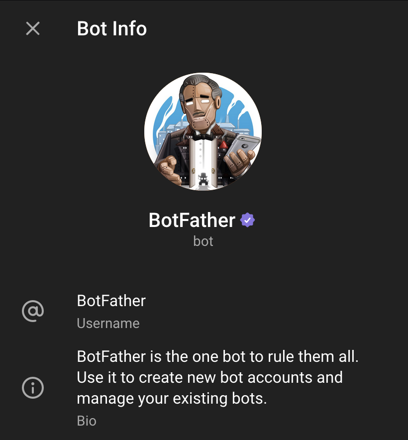

[*Read this article in english*](https://timothechau.vet/en/posts/tutoriels/telegram-bot-python/)

J'ai pris quelques semaines à faire un robot sur Telegram pour un très cher ami. Il réalisait jusqu'ici la tâche redondante de poster du contenu sur les réseaux sociaux avec le même modèle, créé avec Canva. Ce dernier étant très facile d'accès, Canva implique quand même des étapes redondantes qui peuvent être facilement évitées. Les chatbots et Telegram faisant la une des médias en ce moment, j'ai trouvé que c'était une bonne idée de lancer mon propre chatbot. Voici comment j'ai fait.

</br>

<p align="center">
  
  <p style="text-align: center;"><i>Bannière "Octobot" générée par Flux avec Perplexity</i></p>
</p>


</br>
</br>

## Prérequis

Avant de commencer, assurez-vous d'avoir les bons outils de développement:

- Python et Docker installés
- Un compte Azure
- Un compte Telegram

</br>
</br>

## Création du bot Telegram

Pour commencer du côté Telegram, il vous faudra une clé d'API. C'est simple et gratuit

1. Ouvrez Telegram et recherchez "BotFather"
2. Envoyez la commande `/newbot` et suivez les instructions
3. Notez le token API (il reste dans la conversation si jamais vous l'oubliez)

<p align="center">
  
  <p style="text-align: center;"><i>BotFather</i></p>
</p>


</br>
</br>

## Développement du bot en Python

Créez un nouveau fichier `mon_bot.py`. 

Pour la base, il vous faut au moins ça :

```python
import os
import telebot
import threading

TOKEN = os.environ.get('TELEGRAM_TOKEN')
bot = telebot.TeleBot(TOKEN, parse_mode=None)

# Choisissez les commandes pour commencer. Ici /start et /help
@bot.message_handler(commands=['start', 'help'])
def send_welcome(message):
    chat_id = message.chat.id
    bot.reply_to(message, f"Coucou toi 🐍 Ton chat.id est { chat_id }")

# Gérer les autres messages
@bot.message_handler(func=lambda message: True)
def handle_message(message):
    if message.content_type == 'text':
        bot.reply_to(message.text, f"Ton message à l'envers : { message[::-1] }")
    elif message.content_type == 'photo':
        bot.reply_to(message, "Sympa la photo")
        with open('path/to/shrek.png', 'rb') as photo:
            bot.send_photo(message, photo)

# Pour que le conteneur ne s'arrête pas
def heartbeat():
    while True:
        logging.info("Ping")
        time.sleep(600)

def main():
    threading.Thread(target=heartbeat, daemon=True).start()

    while True:
    try:
        bot.polling(none_stop=True, interval=0, timeout=300)
    except Exception as e:
        # Si pas de réponse du serveur Telegram
        time.sleep(15)

if __name__ == '__main__':
    main()
```

</br>

Maintenant, il faut faire en sorte que les librairies soient téléchargeables par le conteneur Docker. Créez un fichier `requirement.txt` avec cette ligne

```
pyTelegramBotAPI==4.20.0
```

</br>
</br>

## Dockerisation du bot

Ici nous faisons appel à des variables d'environnement. Pour tester, c'est mieux de le faire directement avec Docker en local.

Créez un fichier `Dockerfile` :

```dockerfile
FROM python:3.9-slim

WORKDIR /app

COPY requirements.txt requirements.txt
RUN pip install --no-cache-dir -r requirements.txt

COPY . .

CMD ["python", "mon_bot.py"]
```

</br>

Et pour tester, lancez cette commande

```sh
docker build -t mon_bot_python . && docker run -d --name mon_bot_python -e TELEGRAM_BOT_TOKEN="1234567890:AABBCCDDEEFF-gghhiijjkkllmmnnoo123"  mon_bot_python
```

</br>

Maintenant, recherchez le nom de votre bot, celui que vous avez entré avec BotFather. Envoyez-lui un message et voyez par vous-même !

</br>
</br>

## CI/CD pour builder l'image et la push sur GitHub Container Registry

Il vous faudra builder l'image et l'héberger sur un registre de conteneurs. Je choisis GHCR, le registre de GitHub, car je le connais bien.

J'utiliserai aussi la CI/CD de GitHub actions pour lancer ça. Dans le fichier `.github/workflows/build.yml`, il vous faudra au moins ces étapes :

```yaml
name: Builder et Pusher l'image du conteneur

on:
  push:
    branches: [ 'master', 'main' ] 
  workflow_dispatch:

permissions:
  contents: read
  packages: write

jobs:
  build-and-push:
    runs-on: ubuntu-latest

    steps:
    - name: Récupérer le code
      uses: actions/checkout@v4
      with:
        submodules: 'true'

    - name: Configurer Docker Buildx
      uses: docker/setup-buildx-action@v3.6.1 

    - name: Se connecter au GitHub Container Registry
      uses: docker/login-action@v3.3.0
      with:
        registry: ghcr.io
        username: ${{ github.actor }}
        password: ${{ github.token }}

    - name: Récupérer le nom du repository en minuscules
      run: echo "REPO=${GITHUB_REPOSITORY,,}" >>${GITHUB_ENV}

    - name: Builder et Pusher l'image sur GHCR
      uses: docker/build-push-action@v6.5.0
      with:
        context: .
        push: true
        tags: |
          ghcr.io/${{ github.repository }}:latest
          ghcr.io/${{ github.repository }}:${{ github.sha }}
```

Ensuite, sur GitHub (en admettant que vous avez mis les fichiers sur un repository dans GitHub), vous verrez que lors du push de votre commit, le build va automatiquement se lancer.

</br>
</br>

## Déploiement sur une VM

Pour ma part, j'ai réussi de le déployer sur le service PaaS [Azure Web Services](https://azure.microsoft.com/fr-fr/products/app-service/web/), mais j'ai préféré au final mettre Docker dans une VM. J'ai fait ça pour avoir le contrôle sur l'exécution de Docker. Voici comment j'ai fait

1. Créez une machine virtuelle Azure, pour ma part avec Rocky Linux 9.2 comme OS et Standard B2s comme SKU (33€/mois aujourd'hui en région France centrale)
2. SSH sur la VM pour installer Podman ou Docker (Podman pour ma part, car c'est open-source et qu'on aime ça)
    ```bash
    sudo dnf update -y
    sudo dnf install podman -y
    podman --version
    sudo systemctl enable podman
    sudo systemctl start podman
    ```
3. Lancez le conteneur pour qu'il tourne à l'infini
    ```bash
    # Se connecter au registry si votre repository GHCR est privé
    echo "ghp_personal_access_token_à_générer" | podman login ghcr.io -u mon_utilisateur --password-stdin
    # Lancer le conteneur qui se relancera en cas de problème
    podman run -d --replace --restart unless-stopped --name mon_robot_telegram -e TELEGRAM_BOT_TOKEN="1234567890:AABBCCDDEEFF-gghhiijjkkllmmnnoo123" ghcr.io/mon_utilisateur/mon_robot_telegram:latest
    ```
4. (Si jamais le conteneur s'arrête tout seul) Ajoutez le conteneur à `systemd` :
    ```
    podman generate systemd --new --files --name mon_robot_telegram.service
    ```

</br>
</br>

## Conclusion

Pour ce qui est du développement, un robot Telegram ne demande pas beaucoup de compétences. Utiliser Python et Telebot est certainement la méthode la plus simple pour y parvenir, et moi __**j'adore la simplicité**__.

Il y a beaucoup de moyens bien coûteux pour héberger un robot Telegram. Je n'ai pas choisi la manière la plus économique mais ça m'a permis d'apprendre pas mal de choses. 

Gardez bien à l'esprit qu'il n'est pas possible d'héberger deux instances de robots Telegram, donc pas de redondance acceptable hélas

---

Si vous avez des questions ou des suggestions, n'hésitez pas à me contacter par [mail](mailto:timothe@chauvet.cloud), sur [LinkedIn](https://www.linkedin.com/in/timothechauvet/) ou directement en envoyant [une *issue* sur GitHub](https://github.com/timothechauvet/timothechauvet.github.io/issues)